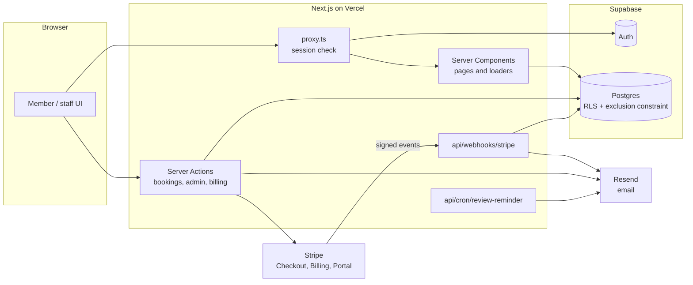

<div align="center">

  

  <h1>Inspire9 Hub</h1>

  <p><strong>The operating system for a coworking space.</strong><br />
  Member onboarding, room booking, payments, memberships, enquiries and reporting in one app, built for Inspire9 in Richmond, Melbourne.</p>

[](https://nextjs.org)
[](https://react.dev)
[](https://www.typescriptlang.org)
[](https://supabase.com)
[](https://stripe.com)
[](https://tailwindcss.com)
[](#testing-and-quality)
[](LICENSE)

[**Live site**](https://inspire9-hub.vercel.app) · [**Report an issue**](https://github.com/Dr-Boz/inspire9-hub/issues)

</div>

---

## Contents

- [Overview](#overview)
- [Features](#features)
- [Architecture](#architecture)
- [Engineering highlights](#engineering-highlights)
- [Tech stack](#tech-stack)
- [Getting started](#getting-started)
- [Configuration](#configuration)
- [Database](#database)
- [Payments and memberships (Stripe)](#payments-and-memberships-stripe)
- [Testing and quality](#testing-and-quality)
- [Project structure](#project-structure)
- [Routes](#routes)
- [Deployment](#deployment)
- [Roadmap](#roadmap)
- [Author and license](#author-and-license)

---

## Overview

Inspire9 Hub replaces spreadsheets, inboxes and paper forms with one system for everyone at the space:

- **Members** complete their safety induction, find a room on an interactive floor plan, pay by card, join a monthly plan and keep every receipt in one place.
- **Staff** review inductions, run the booking schedule, issue refunds, manage rooms and prices, follow up enquiries through a sales pipeline, and see how the space is performing.
- **Prospective members** enquire through a public page, and their enquiry arrives on the leads board with a reply already sent.

It is built on the Next.js App Router with React Server Components and Server Actions, Supabase for Postgres and authentication, Stripe for one-off payments and subscriptions, and Resend for transactional email. Correctness lives in the database and on the server, not in the browser: prices, discounts, booking rules and permissions are all decided server-side.

---

## Features

### For members

| Feature | What it does |
| --- | --- |
| **Safety induction** | A guided form covering contact details, health and emergency information. Booking stays locked until staff approve it, enforced on the server. |
| **Interactive floor plan** | A zoomable plan of Level 1 with live availability. Drag a time window and every room recolours to show what's free. |
| **Room booking** | Pick a room, date and time, then pay through Stripe Checkout. The slot is held the moment checkout starts, so nobody else can take it mid-payment. |
| **Memberships** | Join a monthly or yearly plan, see the next payment date, manage the card and download receipts through Stripe's billing portal. Plans can include a member rate on room bookings. |
| **Hub assistant** | Understands plain-English requests such as *"book the Dream Room tomorrow 2 to 4pm"*, checks availability and starts the booking without leaving the chat. |
| **History** | Bookings, payments, access passes and activity, with filters and pagination, and a downloadable PDF invoice for every paid booking. |
| **Email** | Confirmations with a PDF invoice, cancellation and refund notices, membership welcome, receipts, payment problems and renewal changes. |
| **Dark mode and phones** | Every screen works in light and dark and down to phone width. |

### For staff

| Feature | What it does |
| --- | --- |
| **Dashboard** | Today at a glance: bookings in progress, a room timeline, inductions waiting, membership revenue. |
| **Insights** | Revenue over time, utilisation per room against real opening hours, a busy-hours heatmap, top spenders, cancellation patterns and the enquiry funnel. Exportable to CSV. |
| **Leads** | A sales pipeline from enquiry to member: stages, owners, follow-up dates, notes and a full history of every contact. |
| **Booking schedule** | Every booking, searchable and filterable, with cancel, cancel-and-refund and refund actions. Refunds follow the cancellation policy automatically. |
| **Memberships** | Plans synced from Stripe, who is on each one, who is leaving, and monthly recurring revenue. |
| **Compliance** | The induction review queue with approve and reject, and a complete audit trail. |
| **Rooms, members, announcements, staff** | Manage prices, photos and amenities; view any member's bookings, payments and passes; publish notices to the member dashboard; grant or revoke staff access. |
| **Alerts** | The team inbox hears about new enquiries, new members, cancellations and failed payments. |

---

## Architecture



- **Reads** happen in Server Components, in parallel, with explicit column lists.
- **Writes** go through Server Actions. Each one checks who is calling, validates its input and returns errors as values.
- **Stripe is the source of truth for money.** The webhook mirrors payments and subscriptions into Postgres, in order and idempotently, and sends the related email after it has replied to Stripe.

---

## Engineering highlights

### Double bookings are impossible, not just unlikely

Checking availability and then inserting is a classic race: two members can both see a slot as free and both book it. Here the final word belongs to Postgres, through an exclusion constraint on each room's time ranges:

```sql
exclude using gist (
  workspace_id with =,
  tstzrange(start_date_time, end_date_time) with &&
) where (booking_status in ('confirmed', 'pending'));
```

A booking is held as `pending` before Stripe Checkout opens, so the slot is reserved during payment and released automatically if checkout expires. This was stress-tested against a real Postgres running the same constraint:

| Scenario | Result |
| --- | --- |
| 100 members book the same slot at the same instant | exactly 1 succeeds |
| All 100 pass the availability check together, then insert at once | exactly 1 succeeds |
| 400 members across 8 rooms at once | 0 overlapping bookings |
| One member double-clicks "Book" six times | 1 hold |
| Payment lands after the slot was released and taken by someone else | caught, refunded in full and the member is emailed |

### Booking rules enforced on the server

The browser only shows the rules. `lib/booking-rules.ts` enforces them for every booking, whether it comes from the room list, the floor plan or the assistant:

- opening hours (Mon to Fri 7am to 9pm, Sat 9am to 5pm, closed Sunday)
- 15-minute slots, at least one hour, within a single day
- up to 180 days ahead
- at most three checkouts in progress per member
- holds left over from an unfinished checkout are released after two hours

### Prices are never taken from the browser

Room prices, member discounts and refund amounts are all recomputed on the server. The text on the Stripe receipt is written from the database, not from what the page displayed.

### Subscriptions that stay in sync

Stripe delivers events more than once and out of order. The webhook:

1. re-reads each subscription from Stripe instead of trusting the event's copy;
2. writes with an event-time watermark, so an older event can never overwrite a newer one;
3. decides membership emails from the subscription's current state, and records each one in a `sent_emails` table so it goes out exactly once.

An unknown event type is always acknowledged, so an unhandled event can never get the endpoint switched off and take bookings down with it.

### Melbourne time, everywhere

The hub runs in Melbourne; the servers run in UTC. Every date shown, emailed or printed on an invoice is formatted in `Australia/Melbourne`, including across daylight-saving changes. CI runs the whole test suite a second time under five hostile time zones (UTC, New York, Kolkata, Kiritimati and Santiago), so code that accidentally reads the machine's clock fails before it ships.

### Security

- Anonymous visitors can read nothing but the public plan prices. The service-role key is used only on the server, and only after the caller has been checked.
- Every Server Action and admin page checks the caller's role itself, in addition to the proxy.
- Only same-site redirects after email links; login pages show only messages the app wrote.
- Stripe webhooks are signature-verified; the scheduled job is protected by a secret compared in constant time.
- The public enquiry form has a honeypot, a timing check and rate limits, and never repeats back what a stranger typed.
- Uploads are checked by their actual file contents, not just their declared type.
- Security headers include a content security policy for base URI, plugins, framing and form targets.

### Accessibility

Screens are checked against WCAG 2.2 AA with axe in light and dark mode at desktop and phone widths: contrast, keyboard access, labelled controls, and touch targets of at least 24px. Charts on the insights page have table equivalents for screen readers.

---

## Tech stack

| Layer | Technology |
| --- | --- |
| Framework | Next.js 16.2 (App Router, Server Components, Server Actions, Turbopack) |
| UI | React 19.2, Tailwind CSS 4, Radix UI and shadcn/ui, Framer Motion |
| Language | TypeScript 5 (strict) |
| Database and auth | Supabase: Postgres, Auth, Row-Level Security |
| Payments | Stripe 22: Checkout, Billing (subscriptions), Customer Portal, webhooks |
| Email | Resend with React Email templates |
| PDF | @react-pdf/renderer for invoices |
| Natural language | chrono-node (dates and times) and fuse.js (fuzzy room names) |
| Testing | Vitest, plus axe-core and Puppeteer for accessibility checks |
| Hosting | Vercel, including Vercel Cron |

---

## Getting started

### Prerequisites

- **Node.js 22** (the version CI uses)
- A [Supabase](https://supabase.com) project
- A [Stripe](https://stripe.com) account (test mode is fine for development)
- A [Resend](https://resend.com) account
- The [Stripe CLI](https://docs.stripe.com/stripe-cli), to receive webhooks locally

### Install and run

```bash
git clone https://github.com/Dr-Boz/inspire9-hub.git
cd inspire9-hub
npm install
cp .env.example .env.local   # or create it by hand, see Configuration
npm run dev                  # http://localhost:3000
```

In a second terminal, forward Stripe's events to your machine and copy the `whsec_…` secret it prints into `STRIPE_WEBHOOK_SECRET`:

```bash
stripe listen --forward-to localhost:3000/api/webhooks/stripe
```

### Scripts

| Command | What it does |
| --- | --- |
| `npm run dev` | Development server with Turbopack |
| `npm run build` | Production build |
| `npm start` | Serve the production build |
| `npm test` | Run the test suite once |
| `npm run test:watch` | Tests in watch mode |
| `npm run typecheck` | TypeScript, no output |
| `npm run lint` | ESLint |

---

## Configuration

Set these in `.env.local` for development and in **Vercel → Project Settings → Environment Variables** for production.

| Variable | Required | Purpose |
| --- | --- | --- |
| `NEXT_PUBLIC_SUPABASE_URL` | Yes | Your Supabase project URL. |
| `NEXT_PUBLIC_SUPABASE_PUBLISHABLE_DEFAULT_KEY` | Yes | Supabase publishable (anon) key. Safe in the browser; row-level security protects the data. |
| `SUPABASE_SERVICE_ROLE_KEY` | Yes | Server only. Used after the app has checked who is asking. Never expose it. |
| `STRIPE_SECRET_KEY` | Yes | `sk_test_…` in development, `sk_live_…` in production. |
| `STRIPE_WEBHOOK_SECRET` | Yes | Signing secret of the webhook endpoint (or of `stripe listen` locally). |
| `NEXT_PUBLIC_BASE_URL` | Yes | The site's own address, used for Stripe return links and links in emails. |
| `RESEND_API_KEY` | Yes | Sends all email. |
| `RESEND_FROM_EMAIL` | Production | A sender on a domain verified in Resend, e.g. `Inspire9 Hub <hello@yourdomain.com>`. Without it, Resend's test sender only delivers to your own address. |
| `SUPPORT_INBOX` | No | The team inbox for enquiries, support messages and staff alerts. Defaults to `hello@inspire9.com`. |
| `CRON_SECRET` | Production | Protects the weekly review-reminder job. Vercel Cron sends it automatically. |
| `RESEND_TO_OVERRIDE` | Development only | Sends every email to this one address, so you can test without emailing real members. Leave unset in production. |

---

## Database

The base tables (`members`, `admins`, `workspaces`, `bookings`, `payments`, `access_passes`, `community_entries`, `induction_records`, `announcements`) were created in the Supabase dashboard. The files in `supabase/migrations/` are additive changes on top of them. Each one is idempotent and safe to re-run: paste it into **Supabase → SQL Editor** and run it. For a new environment, apply them in this order:

| # | Migration | Adds |
| --- | --- | --- |
| 1 | `add_room_management_columns.sql` | Editable prices, photos and amenities on rooms |
| 2 | `add_price_drop_and_rating_toggle.sql` | A regular price, so price drops can be shown |
| 3 | `add_floorplan_space_columns.sql` | Links rooms to their place on the floor plan |
| 4 | `add_booking_overlap_constraint.sql` | The double-booking constraint (`btree_gist`) |
| 5 | `add_admin_auth_cascade.sql` | Ties staff records to their logins |
| 6 | `add_booking_audit_columns.sql` | When a booking was made and who cancelled it, and why |
| 7 | `add_payment_columns.sql` | Currency, refund and checkout details on payments |
| 8 | `add_admin_audit.sql` | The staff audit log |
| 9 | `add_analytics_indexes.sql` | Indexes for the insights page |
| 10 | `add_leads.sql` | Leads and their notes |
| 11 | `add_membership_billing.sql` | Plans, subscriptions and subscription invoices |
| 12 | `add_sent_emails.sql` | Once-only delivery for event-driven emails |

Tables holding sensitive or financial data (`admin_audit`, `leads`, `lead_notes`, `subscriptions`, `subscription_invoices`, `sent_emails`) have row-level security enabled with no policies, so only the server can read or write them. `plans` is readable by anyone, since prices are public.

---

## Payments and memberships (Stripe)

### Webhook

Add an endpoint at `https://<your-domain>/api/webhooks/stripe` and subscribe it to these events:

| Event | Used for |
| --- | --- |
| `checkout.session.completed` | Confirming a paid booking, or starting a membership |
| `checkout.session.expired` | Releasing a room held by an abandoned checkout |
| `customer.subscription.created` | New memberships |
| `customer.subscription.updated` | Renewals, cancellations scheduled or undone |
| `customer.subscription.deleted` | Memberships that have ended |
| `invoice.paid` | Membership receipts |
| `invoice.payment_failed` | Payment problems and retry dates |

### Plans

Plans are created in Stripe, never typed into the database. Create a **Product** with a **recurring** Price, then add metadata to the product (or to an individual price, which takes priority):

| Metadata key | Example | Meaning |
| --- | --- | --- |
| `hub_plan_slug` | `resident` | Required. Marks the price as a plan to sell on the site. |
| `hub_booking_discount` | `20` | Optional. Percentage off room bookings for members on this plan. |
| `hub_sort_order` | `1` | Optional. Order on the membership page. |

Then press **Sync from Stripe** on **Admin → Memberships**. If anything is skipped (a one-off price, for example), the sync says why.

### Customer portal

In **Stripe → Settings → Billing → Customer portal**, allow cancellation **at the end of the billing period** and turn plan switching off. Keep Stripe's own receipt emails switched off; the hub sends its own.

---

## Testing and quality

```bash
npm test                     # 500+ tests
npm run typecheck
npm run lint
```

- **Unit tests** cover the logic that matters most: booking rules and time zones, refund policy, member discounts, subscription state and webhook ordering, insight calculations, lead pipeline rules, CSV export safety, email content and escaping, redirects and login messages.
- **Mutation checks:** the critical tests were verified by temporarily breaking the code they protect and confirming they fail.
- **A read-only live test** checks the floor plan against the real database: `LIVE_DB=1 npx vitest run features/booking-map/live.test.ts`.
- **Continuous integration** (`.github/workflows/ci.yml`) runs on every pull request and every push to `main`:
  - typecheck
  - the test suite, then the suite again under five time zones
  - lint
  - a production build

---

## Project structure

```
inspire9-hub/
├── app/
│   ├── (auth)/                  sign in, sign up, password reset
│   ├── (public)/enquire/        public enquiry page (no account needed)
│   ├── (dashboard)/             member area
│   │   ├── dashboard/  spaces/  bookings/  history/
│   │   ├── induction/  profile/  membership/  support/
│   ├── (admin)/admin/           staff area
│   │   ├── insights/  leads/  bookings/  approvals/  rooms/
│   │   ├── members/  memberships/  announcements/  management/
│   ├── api/
│   │   ├── webhooks/stripe/     payments and subscriptions
│   │   ├── invoice/[bookingId]/ PDF invoice download
│   │   └── cron/review-reminder/
│   └── auth/callback/           email link handler
├── components/                  shared UI (sidebars, header, admin building blocks, charts)
├── features/booking-map/        the interactive floor plan
├── lib/
│   ├── booking-rules.ts         server-side booking rules
│   ├── billing/                 Stripe sync, subscription state, emails, discounts
│   ├── email/                   templates, PDF invoice, formatting, send-once
│   ├── admin-*.ts               pure logic behind each admin page (tested)
│   ├── assistant/               the natural-language booking assistant
│   └── supabase/                server, browser and service-role clients
├── supabase/migrations/         SQL to apply in order (see Database)
├── proxy.ts                     session refresh and route protection
└── vercel.json                  scheduled jobs
```

---

## Routes

| Route | Who | |
| --- | --- | --- |
| `/login`, `/signup`, `/forgot-password`, `/reset-password` | Everyone | Accounts |
| `/enquire` | Everyone | Ask about space, no account needed |
| `/dashboard` | Members | Home: next booking, membership, notices, activity |
| `/spaces` | Members | Interactive floor plan |
| `/bookings` | Members | Room list and booking |
| `/history` | Members | Bookings, payments, passes and activity |
| `/membership` | Members | Plans, billing and receipts |
| `/induction`, `/profile`, `/support` | Members | Induction, account details, help and the assistant |
| `/admin` | Staff | Dashboard |
| `/admin/insights` | Staff | Reports and CSV export |
| `/admin/leads` | Staff | Enquiry pipeline |
| `/admin/bookings` | Staff | Booking schedule and refunds |
| `/admin/approvals` | Staff | Induction review and audit log |
| `/admin/rooms`, `/admin/members`, `/admin/memberships`, `/admin/announcements` | Staff | Management |
| `/admin/management` | Super admins | Staff access |

---

## Deployment

The app deploys to **Vercel**; every push to `main` goes to production.

1. Import the repository into Vercel and add the variables from [Configuration](#configuration).
2. Apply the [database migrations](#database) to the production Supabase project.
3. Register the [Stripe webhook](#webhook) for the production domain and create the [plans](#plans).
4. Verify your sending domain in Resend and set `RESEND_FROM_EMAIL`.
5. Vercel Cron runs the review-reminder job every week (see `vercel.json`); set `CRON_SECRET`.

---

## Roadmap

- **Room credits:** included meeting-room hours on a plan, alongside the existing percentage discount.
- **Check-in and no-shows:** know which bookings were actually used.
- **Floor-plan editor:** let staff redraw and relabel the plan themselves.
- **Stricter hold limits:** move the per-member checkout limit into the database, so a burst of requests can't briefly exceed it.

---

## Author and license

Designed and built by **Hesam Zoveidavian Poor** as a final-year project, academic session 2025/2026.

Released under the [MIT License](LICENSE).
